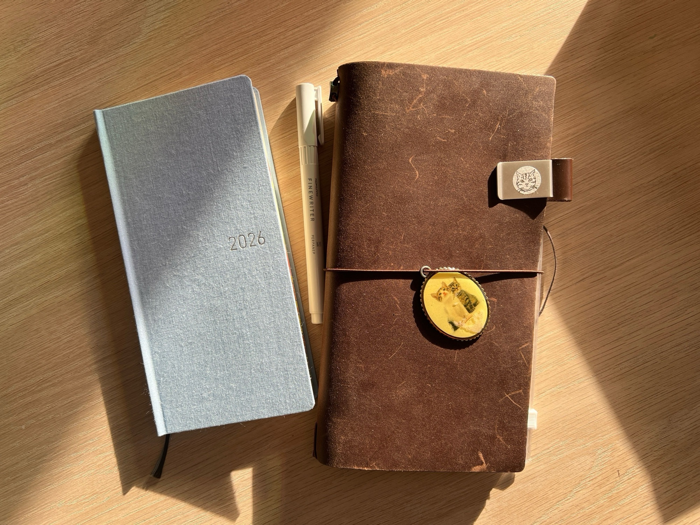

→ See [/colophon](/colophon) for what I use to make this website!

## Hardware

I’m on a beefy 14” M4 Pro, 48GB Macbook. I can run multiple Electron instances at the same time!

## Software

I have been using [JetBrains](https://www.jetbrains.com/)’ IDE (either PHPStorm or WebStorm) since 2016. Before that, I used [Atom](https://atom-editor.cc/) and [Notepad++](https://notepad-plus-plus.org/). I’ve tried VSCode multiple times but I can never get the keybindings right :(

My terminal is [Warp](https://www.warp.dev/), and I use [Claude Code](https://www.claude.com/product/claude-code) for AI-assisted coding.

## Note taking and journaling

I prefer to take notes by hand, and for personal/longer thoughts I use a Traveler’s Notebook with a dotted insert. I use Apple Calendar for stuff that happens on the computer, and a Hobonichi Weeks for stuff that happens in real life (in reality this means I am maintaining 2 agendas at the same time):

